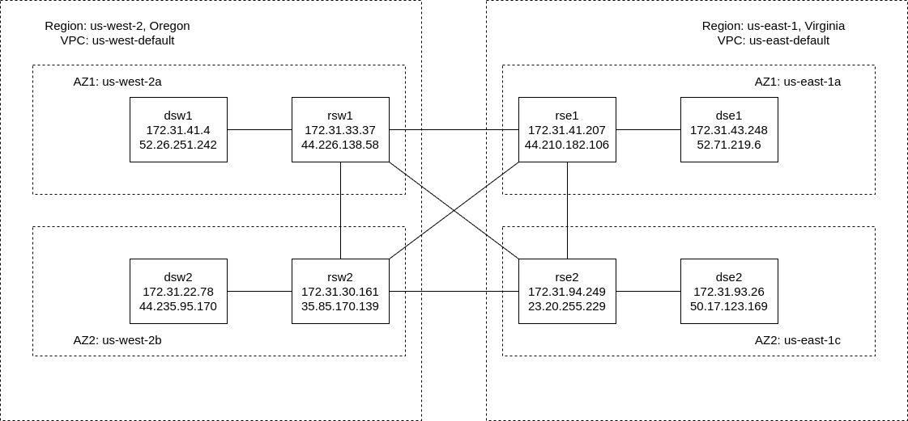

# forgerock_ds_replication

This guide provides step-by-step instructions for setting up a directory services environment across multiple instances and regions. Ensure each step is followed carefully to establish a robust and scalable setup.

## 1. Topology Overview

The layout and connectivity between the different components in the environment.


## 2. Instance Setup and Configuration

- Launch instances across different regions and availability zones as per the topology.
- Assign Elastic IP (EIP) to each instance for stable external access.
- Configure the security group to open ports 4444, 1389, 1636, 8443, and 8989. These ports are essential for administrative access, LDAP(S) services, and replication.

## 3. Preparing Instances

- Transfer the necessary packages to each instance, including the Java installation package and the directory server (DS) package.

## 4. Hosts File Modification

Modify the `/etc/hosts` file on each instance to map the hostnames to the appropriate IP addresses, prioritizing private IPs within the same VPC for interconnectivity. Example entries for `rse1` and `dse1` are provided for reference.

**rse1:**
```bash
127.0.0.1               rse1.example.com
172.31.94.249           rse2.example.com
44.226.138.58           rsw1.example.com
35.85.170.139           rsw2.example.com
```
**dse1: also need to add IPs of all replication servers**
```bash
127.0.0.1               dse1.example.com
172.31.41.207           rse1.example.com
172.31.94.249           rse2.example.com
44.226.138.58           rsw1.example.com
35.85.170.139           rsw2.example.com
```

## 5. Directory Server Setup and Initialization

Set up and start the directory server on each instance with the provided commands. Ensure the `DEPLOYMENT_ID` environment variable is exported with the same value across all instances for consistency.

**export same DEPLOYMENT_ID to each instance**
```bash
export DEPLOYMENT_ID=*****
```

### Setup Commands:

**rse1**
```bash
./setup \
--serverId rse1 \
--deploymentId $DEPLOYMENT_ID \
--deploymentIdPassword password \
--rootUserDN uid=admin \
--rootUserPassword password \
--hostname rse1.example.com \
--adminConnectorPort 4444 \
--replicationPort 8989 \
--bootstrapReplicationServer rse1.example.com:8989 \
--bootstrapReplicationServer rse2.example.com:8989 \
--bootstrapReplicationServer rsw1.example.com:8989 \
--bootstrapReplicationServer rsw2.example.com:8989 \
--acceptLicense \
--start
```

**rse2**
```bash
./setup \
--serverId rse2 \
--deploymentId $DEPLOYMENT_ID \
--deploymentIdPassword password \
--rootUserDN uid=admin \
--rootUserPassword password \
--hostname rse2.example.com \
--adminConnectorPort 4444 \
--replicationPort 8989 \
--bootstrapReplicationServer rse1.example.com:8989 \
--bootstrapReplicationServer rse2.example.com:8989 \
--bootstrapReplicationServer rsw1.example.com:8989 \
--bootstrapReplicationServer rsw2.example.com:8989 \
--acceptLicense \
--start
```

**rsw1**
```bash
./setup \
--serverId rsw1 \
--deploymentId $DEPLOYMENT_ID \
--deploymentIdPassword password \
--rootUserDN uid=admin \
--rootUserPassword password \
--hostname rsw1.example.com \
--adminConnectorPort 4444 \
--replicationPort 8989 \
--bootstrapReplicationServer rse1.example.com:8989 \
--bootstrapReplicationServer rse2.example.com:8989 \
--bootstrapReplicationServer rsw1.example.com:8989 \
--bootstrapReplicationServer rsw2.example.com:8989 \
--acceptLicense \
--start
```

**rsw2**
```bash
./setup \
--serverId rsw2 \
--deploymentId $DEPLOYMENT_ID \
--deploymentIdPassword password \
--rootUserDN uid=admin \
--rootUserPassword password \
--hostname rsw2.example.com \
--adminConnectorPort 4444 \
--replicationPort 8989 \
--bootstrapReplicationServer rse1.example.com:8989 \
--bootstrapReplicationServer rse2.example.com:8989 \
--bootstrapReplicationServer rsw1.example.com:8989 \
--bootstrapReplicationServer rsw2.example.com:8989 \
--acceptLicense \
--start
```

**dse1**
```bash
./setup \
--serverId dse1 \
--deploymentId $DEPLOYMENT_ID \
--deploymentIdPassword password \
--rootUserDN uid=admin \
--rootUserPassword password \
--hostname dse1.example.com \
--adminConnectorPort 4444 \
--ldapPort 1389 \
--enableStartTls \
--ldapsPort 1636 \
--httpsPort 8443 \
--bootstrapReplicationServer rse1.example.com:8989 \
--profile ds-evaluation \
--set ds-evaluation/generatedUsers:100 \
--profile am-config \
--set am-config/amConfigAdminPassword:password \
--profile am-cts \
--set am-cts/amCtsAdminPassword:password \
--profile am-identity-store \
--set am-identity-store/amIdentityStoreAdminPassword:password \
--profile idm-repo \
--set idm-repo/domain:forgerock.com \
--acceptLicense \
--start
```

**dse2**
```bash
./setup \
--serverId dse2 \
--deploymentId $DEPLOYMENT_ID \
--deploymentIdPassword password \
--rootUserDN uid=admin \
--rootUserPassword password \
--hostname dse2.example.com \
--adminConnectorPort 4444 \
--ldapPort 1389 \
--enableStartTls \
--ldapsPort 1636 \
--httpsPort 8443 \
--bootstrapReplicationServer rse2.example.com:8989 \
--profile ds-evaluation \
--set ds-evaluation/generatedUsers:100 \
--profile am-config \
--set am-config/amConfigAdminPassword:password \
--profile am-cts \
--set am-cts/amCtsAdminPassword:password \
--profile am-identity-store \
--set am-identity-store/amIdentityStoreAdminPassword:password \
--profile idm-repo \
--set idm-repo/domain:forgerock.com \
--acceptLicense \
--start
```

**dsw1**
```bash
./setup \
--serverId dsw1 \
--deploymentId $DEPLOYMENT_ID \
--deploymentIdPassword password \
--rootUserDN uid=admin \
--rootUserPassword password \
--hostname dsw1.example.com \
--adminConnectorPort 4444 \
--ldapPort 1389 \
--enableStartTls \
--ldapsPort 1636 \
--httpsPort 8443 \
--bootstrapReplicationServer rsw1.example.com:8989 \
--profile ds-evaluation \
--set ds-evaluation/generatedUsers:100 \
--profile am-config \
--set am-config/amConfigAdminPassword:password \
--profile am-cts \
--set am-cts/amCtsAdminPassword:password \
--profile am-identity-store \
--set am-identity-store/amIdentityStoreAdminPassword:password \
--profile idm-repo \
--set idm-repo/domain:forgerock.com \
--acceptLicense \
--start
```

**dsw2**
```bash
./setup \
--serverId dsw2 \
--deploymentId $DEPLOYMENT_ID \
--deploymentIdPassword password \
--rootUserDN uid=admin \
--rootUserPassword password \
--hostname dsw2.example.com \
--adminConnectorPort 4444 \
--ldapPort 1389 \
--enableStartTls \
--ldapsPort 1636 \
--httpsPort 8443 \
--bootstrapReplicationServer rsw2.example.com:8989 \
--profile ds-evaluation \
--set ds-evaluation/generatedUsers:100 \
--profile am-config \
--set am-config/amConfigAdminPassword:password \
--profile am-cts \
--set am-cts/amCtsAdminPassword:password \
--profile am-identity-store \
--set am-identity-store/amIdentityStoreAdminPassword:password \
--profile idm-repo \
--set idm-repo/domain:forgerock.com \
--acceptLicense \
--start
```

## 6. Group and Failover Configuration

Configure group IDs and failover orders to manage directory server groups and their replication failover behavior. This step is critical for ensuring high availability and resilience.

**rse1, set group-id, use this command to group different ds, usually by geography locations**
```bash
cd opendj/bin
./dsconfig \
set-global-configuration-prop \
--set group-id:us-east-1a \
--hostname rse1.example.com \
--port 4444 \
--bindDN uid=admin \
--bindPassword password \
--usePkcs12TrustStore ../config/keystore \
--trustStorePassword:file ../config/keystore.pin \
--no-prompt
```

**set group failover order, it will use this order to find available rs**
```bash
./dsconfig \
set-global-configuration-prop \
--set group-id-failover-order:us-east-1a,us-east-1c,us-west-2a,us-west-2b \
--hostname rse1.example.com \
--port 4444 \
--bindDN uid=admin \
--bindPassword password \
--usePkcs12TrustStore ../config/keystore \
--trustStorePassword:file ../config/keystore.pin \
--no-prompt
```

**dse1**
```bash
./dsconfig \
set-global-configuration-prop \
--set group-id:us-east-1a \
--hostname dse1.example.com \
--port 4444 \
--bindDN uid=admin \
--bindPassword password \
--usePkcs12TrustStore ../config/keystore \
--trustStorePassword:file ../config/keystore.pin \
--no-prompt

./dsconfig \
set-global-configuration-prop \
--set group-id-failover-order:us-east-1a,us-east-1c,us-west-2a,us-west-2b \
--hostname dse1.example.com \
--port 4444 \
--bindDN uid=admin \
--bindPassword password \
--usePkcs12TrustStore ../config/keystore \
--trustStorePassword:file ../config/keystore.pin \
--no-prompt
```

**rse2**
```bash
./dsconfig \
set-global-configuration-prop \
--set group-id:us-east-1c \
--hostname rse2.example.com \
--port 4444 \
--bindDN uid=admin \
--bindPassword password \
--usePkcs12TrustStore ../config/keystore \
--trustStorePassword:file ../config/keystore.pin \
--no-prompt

./dsconfig \
set-global-configuration-prop \
--set group-id-failover-order:us-east-1c,us-east-1a,us-west-2a,us-west-2b \
--hostname rse2.example.com \
--port 4444 \
--bindDN uid=admin \
--bindPassword password \
--usePkcs12TrustStore ../config/keystore \
--trustStorePassword:file ../config/keystore.pin \
--no-prompt
```

**dse2**
```bash
./dsconfig \
set-global-configuration-prop \
--set group-id:us-east-1c \
--hostname dse2.example.com \
--port 4444 \
--bindDN uid=admin \
--bindPassword password \
--usePkcs12TrustStore ../config/keystore \
--trustStorePassword:file ../config/keystore.pin \
--no-prompt

./dsconfig \
set-global-configuration-prop \
--set group-id-failover-order:us-east-1c,us-east-1a,us-west-2a,us-west-2b \
--hostname dse2.example.com \
--port 4444 \
--bindDN uid=admin \
--bindPassword password \
--usePkcs12TrustStore ../config/keystore \
--trustStorePassword:file ../config/keystore.pin \
--no-prompt
```

**rsw1**
```bash
./dsconfig \
set-global-configuration-prop \
--set group-id:us-west-2a \
--hostname rsw1.example.com \
--port 4444 \
--bindDN uid=admin \
--bindPassword password \
--usePkcs12TrustStore ../config/keystore \
--trustStorePassword:file ../config/keystore.pin \
--no-prompt

./dsconfig \
set-global-configuration-prop \
--set group-id-failover-order:us-west-2a,us-west-2b,us-east-1a,us-east-1c \
--hostname rsw1.example.com \
--port 4444 \
--bindDN uid=admin \
--bindPassword password \
--usePkcs12TrustStore ../config/keystore \
--trustStorePassword:file ../config/keystore.pin \
--no-prompt
```

**dsw1**
```bash
./dsconfig \
set-global-configuration-prop \
--set group-id:us-west-2a \
--hostname dsw1.example.com \
--port 4444 \
--bindDN uid=admin \
--bindPassword password \
--usePkcs12TrustStore ../config/keystore \
--trustStorePassword:file ../config/keystore.pin \
--no-prompt

./dsconfig \
set-global-configuration-prop \
--set group-id-failover-order:us-west-2a,us-west-2b,us-east-1a,us-east-1c \
--hostname dsw1.example.com \
--port 4444 \
--bindDN uid=admin \
--bindPassword password \
--usePkcs12TrustStore ../config/keystore \
--trustStorePassword:file ../config/keystore.pin \
--no-prompt
```

**rsw2**
```bash
./dsconfig \
set-global-configuration-prop \
--set group-id:us-west-2b \
--hostname rsw2.example.com \
--port 4444 \
--bindDN uid=admin \
--bindPassword password \
--usePkcs12TrustStore ../config/keystore \
--trustStorePassword:file ../config/keystore.pin \
--no-prompt

./dsconfig \
set-global-configuration-prop \
--set group-id-failover-order:us-west-2b,us-west-2a,us-east-1a,us-east-1c \
--hostname rsw2.example.com \
--port 4444 \
--bindDN uid=admin \
--bindPassword password \
--usePkcs12TrustStore ../config/keystore \
--trustStorePassword:file ../config/keystore.pin \
--no-prompt
```

**dsw2**
```bash
./dsconfig \
set-global-configuration-prop \
--set group-id:us-west-2b \
--hostname dsw2.example.com \
--port 4444 \
--bindDN uid=admin \
--bindPassword password \
--usePkcs12TrustStore ../config/keystore \
--trustStorePassword:file ../config/keystore.pin \
--no-prompt

./dsconfig \
set-global-configuration-prop \
--set group-id-failover-order:us-west-2b,us-west-2a,us-east-1a,us-east-1c \
--hostname dsw2.example.com \
--port 4444 \
--bindDN uid=admin \
--bindPassword password \
--usePkcs12TrustStore ../config/keystore \
--trustStorePassword:file ../config/keystore.pin \
--no-prompt
```

## 7. Managing Bootstrap Replication Servers

Retrieve and update bootstrap replication server configurations as needed to include new servers or modify existing connections.

**rse1, get bootstrap servers**
```bash
./dsconfig \
get-synchronization-provider-prop \
--provider-name "Multimaster Synchronization" \
--hostname rse1.example.com \
--port 4444 \
--bindDN uid=admin \
--bindPassword password \
--usePkcs12TrustStore ../config/keystore \
--trustStorePassword:file ../config/keystore.pin \
--no-prompt
```

**add new bootstrap sever, like rse3, run this command on all other rs**
```bash
./dsconfig \
set-synchronization-provider-prop \
--provider-name "Multimaster Synchronization" \
--add bootstrap-replication-server:rse3.example.com:8989 \
--hostname rse1.example.com \
--port 4444 \
--bindDN uid=admin \
--bindPassword password \
--usePkcs12TrustStore ../config/keystore \
--trustStorePassword:file ../config/keystore.pin \
--no-prompt
```

## 8. Manual Replication Initialization

In cases where a directory server is out of sync, use the following command to manually initialize replication from a server that has a complete dataset.

**dse1, DN: dc=example,dc=com**
```bash
./dsrepl \
initialize \
--baseDN dc=example,dc=com \
--toAllServers \
--hostname dse1.example.com \
--port 4444 \
--bindDN uid=admin \
--bindPassword password \
--trustStorePath ../config/keystore \
--trustStorePassword:file ../config/keystore.pin \
--no-prompt
```

## 9. Adjusting Replication Purge Delay

Modify the replication-purge-delay setting to control the period after which out-of-sync data cannot be automatically synchronized and requires manual initialization.

**dse1, default is 3d**
```bash
./dsconfig \
set-synchronization-provider-prop \
--provider-name "Multimaster Synchronization" \
--set replication-purge-delay:12h \
--hostname dse1.example.com \
--port 4444 \
--usePkcs12TrustStore ../config/keystore \
--trustStorePasswordFile ../config/keystore.pin \
--bindDN uid=admin \
--bindPassword password \
--no-prompt
```

## 10. Replication with Different DN

Use one set of RS to replicate date with different DN

**dse3, DN: dc=example,dc=com and ou=identities**
```bash
export DEPLOYMENT_ID=*****
./setup \
--serverId dse3 \
--deploymentId $DEPLOYMENT_ID \
--deploymentIdPassword password \
--rootUserDN uid=admin \
--rootUserPassword password \
--hostname dse3.example.com \
--adminConnectorPort 4444 \
--ldapPort 1389 \
--enableStartTls \
--ldapsPort 1636 \
--httpsPort 8443 \
--bootstrapReplicationServer rse1.example.com:8989 \
--profile ds-evaluation \
--set ds-evaluation/generatedUsers:100 \
--profile am-identity-store \
--set am-identity-store/amIdentityStoreAdminPassword:password \
--acceptLicense \
--start
```

**dse4, DN: dc=example,dc=com and ou=identities**
```bash
export DEPLOYMENT_ID=*****
./setup \
--serverId dse4 \
--deploymentId $DEPLOYMENT_ID \
--deploymentIdPassword password \
--rootUserDN uid=admin \
--rootUserPassword password \
--hostname dse4.example.com \
--adminConnectorPort 4444 \
--ldapPort 1389 \
--enableStartTls \
--ldapsPort 1636 \
--httpsPort 8443 \
--bootstrapReplicationServer rse2.example.com:8989 \
--profile ds-evaluation \
--set ds-evaluation/generatedUsers:100 \
--profile am-identity-store \
--set am-identity-store/amIdentityStoreAdminPassword:password \
--acceptLicense \
--start
```

**dsw3, DN: dc=example,dc=com and dc=openidm**
```bash
export DEPLOYMENT_ID=*****
./setup \
--serverId dsw3 \
--deploymentId $DEPLOYMENT_ID \
--deploymentIdPassword password \
--rootUserDN uid=admin \
--rootUserPassword password \
--hostname dsw3.example.com \
--adminConnectorPort 4444 \
--ldapPort 1389 \
--enableStartTls \
--ldapsPort 1636 \
--httpsPort 8443 \
--bootstrapReplicationServer rsw1.example.com:8989 \
--profile ds-evaluation \
--set ds-evaluation/generatedUsers:100 \
--profile idm-repo \
--set idm-repo/domain:forgerock.com \
--acceptLicense \
--start
```

**dsw4, DN: dc=example,dc=com and dc=openidm**
```bash
export DEPLOYMENT_ID=*****
./setup \
--serverId dsw4 \
--deploymentId $DEPLOYMENT_ID \
--deploymentIdPassword password \
--rootUserDN uid=admin \
--rootUserPassword password \
--hostname dsw4.example.com \
--adminConnectorPort 4444 \
--ldapPort 1389 \
--enableStartTls \
--ldapsPort 1636 \
--httpsPort 8443 \
--bootstrapReplicationServer rsw2.example.com:8989 \
--profile ds-evaluation \
--set ds-evaluation/generatedUsers:100 \
--profile idm-repo \
--set idm-repo/domain:forgerock.com \
--acceptLicense \
--start
```